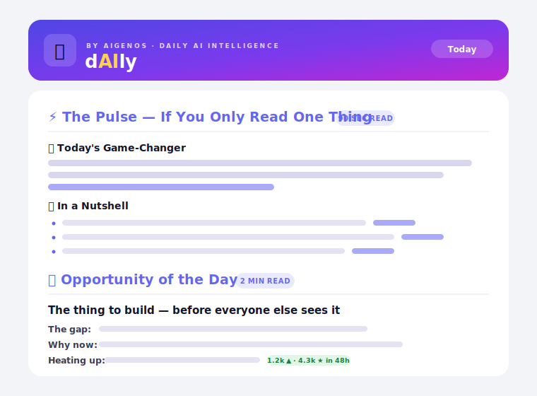

<div align="center">



**Reads everything in AI daily and tells you what to build.**
One email · ~90 seconds · every claim source-linked.

[](https://github.com/aigenos/dAIly/actions/workflows/daily-ai-digest.yml)
[](LICENSE)
[](https://www.python.org/)
[](.github/workflows/daily-ai-digest.yml)
[](#run-your-own-in-5-minutes)

<h3>
  <a href="https://aigenos.github.io/dAIly">📬 Read today's issue (live)</a> &nbsp;·&nbsp;
  <a href="https://aigenos.github.io/dAIly#subscribe">✉️ Subscribe</a> &nbsp;·&nbsp;
  <a href="#run-your-own-in-5-minutes">🚀 Run your own in 5 min</a>
</h3>

<picture>
  <source media="(prefers-color-scheme: dark)" srcset="docs/assets/hero-dark.svg">
  
</picture>

*What lands in your inbox, light and dark — [see today's real issue live](https://aigenos.github.io/dAIly).*

</div>

## What makes this different

Every other AI digest answers *"what happened?"*. dAIly answers **"what should
I build?"** Each issue closes the loop from news → research → a concrete,
evidence-backed **Opportunity of the Day**: the gap, why it's newly tractable
*this week*, what shape to build it as, the wedge, and a first step you can take
in the next 7 days — every claim backed by **at least two independent signals**
(a paper + a launch, a benchmark move + star velocity), each one linked.

Here's the shape of one (sample — swap in a favorite from your
[live archive](https://aigenos.github.io/dAIly) once issues accumulate):

> ### 🚀 Opportunity of the Day — *TraceLint*
> - **The gap:** agent frameworks ship eval harnesses, but nobody lints
>   *production traces* — silent tool-call failures only surface in user
>   complaints. ([the paper that exposes it](https://arxiv.org/))
> - **Why now:** this week's long-horizon agent benchmark shows error
>   compounding dominates failures, and the new traces API makes the data
>   accessible for the first time.
> - **Build as:** OSS library + hosted dashboard — devs adopt linters bottom-up.
> - **Wedge & moat:** first user is any team already exporting traces; the rule
>   pack compounds with every contributed failure pattern.
> - **Already heating up:** the benchmark thread hit **#1 on HN (480 pts)**;
>   a related repo gained **2.1k stars in 72h**.
> - **First step this week:** lint 100 public traces, publish the failure
>   taxonomy as a gist, post to r/LocalLLaMA.

And it keeps score: every Opportunity is logged to
[`docs/receipts.md`](docs/receipts.md) with date + issue link — so when one of
them ships as a real product months later, the receipt is public. *"My agent
called it first"* is the whole point.

## Make this a daily briefing for YOUR field — change one env var

The AI sources are just the default preset. Set `SOURCE_PRESET` and the same
agent becomes a daily analyst for another field:

```bash
SOURCE_PRESET=security   # infosec: Krebs, Schneier, Project Zero, r/netsec, cs.CR
SOURCE_PRESET=biotech    # bio: Nature Biotech, bioRxiv, Fierce Biotech, q-bio
SOURCE_PRESET=fintech    # fintech: Finextra, Stripe, TC Fintech, q-fin
```

Add your own field in one small file — see [`src/presets/`](src/presets/) and
[CONTRIBUTING.md](CONTRIBUTING.md). Everything else (synthesis, email, archive,
opportunity hunting) works unchanged.

## The briefing — an information pyramid

Structured so 90 seconds gets you everything essential; 10 minutes gets you
depth. Each section carries a read-time budget; every claim carries a source
link. An item appears in **at most one section** — no triple-reporting the same
launch.

1. **⚡ The Pulse (90 sec)** — *Today's Game-Changer* (the one thing) + *In a
   Nutshell* (8–12 one-line bullets covering everything else). Stands alone.
2. **🚀 Opportunity of the Day (2 min)** — the single most compelling thing to
   build today. *(Public/free — the viral hook.)*
3. **🗺️ Full Opportunity Map (5 min)** — 4–6 *more* buildable bets in the same
   format. *(Private — your secret sauce / paid tier; see freemium model below.)*
4. **📊 Stack Signals (3 min)** — benchmark/eval moves, repo & model velocity,
   and funding/launches *with the thesis extracted*.
5. **🔬 Deep Reads (optional)** — the one paper to read end-to-end + a scanning
   list of supporting research.

### Freemium model

The **Opportunity of the Day** ships publicly (email, archive, chat teaser) as
the hook. The **Full Opportunity Map** is a private section (`src/private/`,
gitignored) — it's in *your* email but automatically stripped from the public
archive, which shows a subscribe CTA instead. Free tier drives distribution;
the full map is your paid/private tier.

## Run your own in 5 minutes

### 1. Fork this repo, get two keys
- **Gemini API key** → https://aistudio.google.com/apikey (default; free tier covers a daily run)
  _(or, if `PROVIDER=claude`, an **Anthropic key** → https://console.anthropic.com/settings/keys)_
- **Resend API key** → https://resend.com/api-keys (free tier covers a daily email)

> The default sender `onboarding@resend.dev` can only send to the **email of the
> Resend account owner**. Sign up for Resend with your inbox (or verify a domain
> and set `EMAIL_FROM`) so delivery works.

### 2. Add them to GitHub
**Settings → Secrets and variables → Actions**.

**Secrets:** `GEMINI_API_KEY` (or `ANTHROPIC_API_KEY`) + `RESEND_API_KEY`
**Variables (optional):** `PROVIDER`, `EMAIL_TO`, `EMAIL_FROM`, `DIGEST_MODEL`,
`SOURCE_PRESET`, `LOOKBACK_DAYS`, `ENABLE_WEB_SEARCH`.

### 3. Run it
- **Manually:** Actions tab → *Daily AI Digest* → **Run workflow**. Check your inbox.
- **Automatic:** daily at **12:00 UTC**. Change the `cron` in the workflow to taste.
- **Polish (optional):** `bash scripts/repo_setup.sh` sets your fork's
  description + topics via the `gh` CLI.

## Run locally

```bash
pip install -r requirements.txt
cp .env.example .env          # fill in GEMINI_API_KEY (or ANTHROPIC_API_KEY) + RESEND_API_KEY
python -m src.main            # builds digest, writes digest_YYYYMMDD.html, emails it
```

### Test the whole pipeline for free (no tokens, no email)

```bash
# one-time: install ollama (https://ollama.com), then
ollama serve &
ollama pull qwen2.5:14b        # or llama3.1, qwen3:8b, etc.

PROVIDER=ollama DRY_RUN=true python -m src.main
# → writes digest_YYYYMMDD.html locally; skips Resend. Open it in a browser.
```

To preview the light/dark theme: open the HTML in Chrome, then DevTools →
**Rendering → Emulate prefers-color-scheme** to flip modes (or toggle your OS theme).

> **Resilience:** transient `503 / 429 / overloaded` errors are retried with
> exponential backoff (5s → 10s → 20s) before failing. Broken feeds, a corrupt
> dedup state file, or link-check network trouble are all fail-open — logged,
> never fatal. arXiv gets a wide enough lookback that weekends don't leave the
> research section empty.

## Provider (Gemini, Claude, or Ollama)

Analysis is pluggable via the `PROVIDER` env var — no code change to switch:

| `PROVIDER` | Default model | Web grounding | Key needed |
|------------|---------------|---------------|------------|
| `gemini` (default) | `gemini-2.5-flash` | Google Search | `GEMINI_API_KEY` |
| `claude` | `claude-sonnet-4-6` | web_search tool | `ANTHROPIC_API_KEY` |
| `ollama` | `llama3.1` | none (RSS + arXiv only) | *(none — local)* |

Override the model anytime with `DIGEST_MODEL` (e.g. `gemini-2.5-pro`,
`claude-opus-4-8`, `qwen2.5:14b`). Only the selected provider's key is required.
Ollama streams output to the terminal so you can watch generation live.

### Two-pass quality/cost split (`OPPORTUNITY_MODEL`)

The bulk of a digest is summarization — a cheap model does it fine. The
**Opportunity of the Day** is the product. Split them:

```bash
DIGEST_MODEL=gemini-2.5-flash-lite   # pennies: curation + summaries
OPPORTUNITY_MODEL=gemini-2.5-pro     # the one section worth a stronger model
```

When `OPPORTUNITY_MODEL` is set, the opportunity sections are re-synthesized in
a second pass by the stronger model (with the rest of the digest as context).
Unset, the pipeline runs exactly one pass with `DIGEST_MODEL` — the cost
profile you had before. Rough tradeoff: the second pass adds one more model
call on a ~10K-token prompt, so flash-lite + pro costs a few cents/day versus
running pro for everything at ~10× that.

> **Note:** web-grounded backfill (Stack Signals funding/benchmarks,
> dropped-feed labs) only runs on Gemini/Claude. Ollama produces a solid digest
> from the RSS + arXiv + HF candidate set, but won't fill gaps that need live
> search.

## Sources (the `ai` preset)

Only feeds verified reachable (HTTP 200) are fetched deterministically; anything
without a reliable RSS is backfilled by the LLM's web grounding.

| Type | Covered |
|------|---------|
| Frontier labs | OpenAI, Google DeepMind, Google AI, Microsoft (Research + AI), Hugging Face, Cohere |
| Newsletters | Latent Space, Import AI, Ahead of AI, Interconnects, The Gradient, TLDR AI, Last Week in AI, Gradient Flow, The Rundown AI |
| Infra / tooling | LangChain, Together AI, NVIDIA Developer, AWS ML Blog |
| Community | r/LocalLLaMA, r/MachineLearning, r/OpenAI, Hacker News (AI/LLM/agent, 50+ pts) |
| Research | arXiv (`cs.AI`, `cs.LG`, `cs.CL`, `cs.MA`) + **HF Daily Papers** (community-upvoted "must-reads") |
| Web-grounded backfill | Anthropic, Meta AI, Mistral, xAI, DeepSeek, Qwen, The Batch, The Neuron, LlamaIndex/Pinecone/Weaviate/Modal, LMSYS/SWE-bench leaderboards, GitHub & HF trending, YC/Product Hunt launches, AI funding rounds |

HF Daily Papers are ranked by community upvotes so genuine must-reads beat merely
recent ones. arXiv keyword queries stay agentic-focused (agents, tool-use,
memory, planning, RAG, reasoning benchmarks).

## Architecture

```
                 sources.py ◄── src/presets/ (SOURCE_PRESET: ai|security|biotech|fintech|…)
                     │
fetchers.py ──► state.py ──► analyzer.py ──► providers.py ──► linkcheck.py ──► emailer.py
 RSS + arXiv    cross-day    rank + cap +    gemini|claude|    HEAD-check       light/dark HTML,
 + HF Papers    dedup        prompt + 2-pass ollama (+ web     every link,      footer links,
                (.state/)    + post-process  grounding)        flag dead        Resend delivery
                                                                  │
                                                                  ├─► archive.py ──► docs/
                                                                  │    index.html · digests/ ·
                                                                  │    feed.xml · receipts.md
                                                                  │    (private sections stripped)
                                                                  └─► notifiers.py / audio.py
```

Orchestrated by `src/main.py`, scheduled by a GitHub Actions cron
(`.github/workflows/daily-ai-digest.yml`) — no servers to run.

## Tests

```bash
python -m pytest -q tests/        # or: python -m unittest discover -s tests
```

## Configuration reference

All knobs are environment variables; see [`.env.example`](.env.example). Notable:

- `PROVIDER=gemini|claude|ollama` — pick the analysis engine.
- `DIGEST_MODEL` / `OPPORTUNITY_MODEL` — bulk model / optional stronger
  opportunity model (two-pass).
- `SOURCE_PRESET=ai|security|biotech|fintech` — retarget the whole briefing.
- `ENABLE_WEB_SEARCH=false` — run purely from RSS + arXiv + HF (cheaper, narrower).
- `LOOKBACK_DAYS` — how many days count as "latest" (7 recommended).
- `CROSS_DAY_DEDUP=false` — disable the seen-items filter (docs/.state/).
- `ENABLE_LINK_CHECK=false` — skip the pre-send dead-link check.
- `SUBSCRIBE_URL` / `SUBSCRIBE_EMBED_HTML` / `UNSUBSCRIBE_URL` — footer + CTA links.
- `SHOW_MODEL_ATTRIBUTION=false` — hide the "powered by …" footer line.

## Customizing sources

Pick a preset (`SOURCE_PRESET`) or edit `src/sources.py` directly:
- `RSS_FEEDS` — add/remove feeds (name, url, category). Keep only reachable ones.
- `WEB_SEARCH_TARGETS` — plain-language sources for the LLM to search/verify.
- `ARXIV_CATEGORIES` / `ARXIV_QUERIES` — tune the research net.

To package your changes as a reusable preset, see [CONTRIBUTING.md](CONTRIBUTING.md).

## Publish a public archive (GitHub Pages)

Set `PUBLISH_ARCHIVE=true` and each run writes a browsable site to `docs/`:
`docs/index.html` lists every issue (with each day's Game-Changer as preview),
`docs/digests/digest_YYYYMMDD.html` is each day's digest, `docs/feed.xml` is an
Atom feed of the archive, and `docs/receipts.md` is the opportunity log. Enable
serving in **Settings → Pages → Deploy from branch → `main` → `/docs`**. The
workflow commits `docs/` back automatically. Set `SITE_URL` to your Pages URL so
emails and chat posts can link the full issue.

## Multi-channel delivery

Besides email, post a short teaser (The Pulse + a link to the full issue) to chat:
set any of `SLACK_WEBHOOK_URL`, `DISCORD_WEBHOOK_URL`, or
`TELEGRAM_BOT_TOKEN` + `TELEGRAM_CHAT_ID`. Unconfigured channels are skipped.

## Audio digest

Set `ENABLE_AUDIO=true` (needs `pip install gTTS`, free, no key) to voice The
Pulse to an MP3 in `AUDIO_DIR` — a listen-on-your-commute version. In CI it's
uploaded as a build artifact.

## Custom & private sections

The digest's sections are composable. Public sections live in `src/analyzer.py`;
you can add your own **private** sections under `src/private/` (gitignored) that
never ship in the public repo and are **automatically stripped from the public
archive** via their `<!--SECTION:id-->` markers. See
[`src/private/README.md`](src/private/README.md). To run a private section in CI
without committing it, base64-encode the module into the `OPPORTUNITY_B64` secret
— the workflow restores it for the run only.

## Contributing

PRs welcome — new sources, new field presets, fixes. Start with
[CONTRIBUTING.md](CONTRIBUTING.md); please follow the
[Code of Conduct](CODE_OF_CONDUCT.md).
